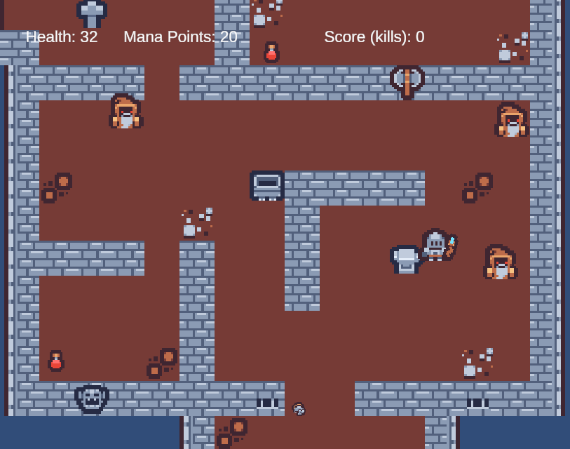

# Counter Knights: Arcane Offensive

[Play in Browser Here](https://ckendrick-mqu.itch.io/counter-knights-arcane-offensive) 

A Unity WebGL application demonstrating real-time vector math, deterministic state management, and algorithmic input calculation. While presented as a tactical 2D shooter, the project serves as a practical application of custom physics mathematics, AI state machines, and browser-based performance optimisation.

---

## Core Application Loop

* **Objective:** Users must navigate a 2D environment and eliminate all target entities within a strict time constraint.
* **Input & Resource Management:** Movement (WASD) and action execution (Mouse) are tied to a finite resource pool (Mana) that requires manual state resetting (Right Click).
* **Algorithmic Recoil (The Core Pillar):** The primary user challenge revolves around a dynamic recoil system. Player movement and rapid inputs continuously increase a deviation variable, forcing users to balance input speed with calculated accuracy. Safe zones within the environment naturally pace the application, allowing decay rates to reset.

---

## Technical Implementation

I prioritised WebGL stability and rapid iteration by avoiding heavy, pre-built physics engines and complex camera systems.

* **Mathematical Deviation Tracking:** The core combat loop relies on a custom recoil algorithm. It calculates precise deviation using dynamic variables that increase with action frequency and decay over time. This ensures user input directly dictates the underlying mathematical state.
* **Finite State Machines (FSM):** Enemy logic is driven by raycasting for line-of-sight checks. Establishing or breaking LOS triggers a lightweight FSM (Idle → Detect → Execute) that manages AI behaviour without bogging down the main execution thread.
* **Deterministic Movement:** To ensure browser stability, movement is strictly transform-based rather than physics-driven. This keeps motion entirely deterministic, predictable, and computationally inexpensive.
* **Component-Driven Design:** Action outputs (spells) are prefab-driven, allowing independent tuning of variables (damage, spread) without modifying the core control flows. Characters use lightweight variables to track internal state rather than relying on UI-heavy event listeners.

> **Trade-offs:** The current implementation relies on frequent object instantiation during the action loop, which introduces runtime memory allocations and predictable routines.

---

## Roadmap & Optimisation

* **Memory Management (Object Pooling):** Implement strict object pooling for projectiles to eliminate Garbage Collection (GC) spikes and ensure a consistent framerate lock.
* **Procedural Behaviour:** Introduce dynamic spawn logic and expanded FSM states to introduce variance and break predictable AI routines.
* **Input Accessibility:** Integrate comprehensive gamepad API support for broader hardware accessibility.

---

## Credits & Assets

* **Made by:** Christopher Kendrick
* **Music:** ["Hitman" by Kevin MacLeod](https://incompetech.com) | Licensed under Creative Commons: By Attribution 4.0 License.
* **Audio/Visuals:** [Tiny Dungeon & Impact Sounds by Kenney](https://kenney.nl)
