# Game Prototype Report

# WebGL Build

Provide detail of your WebGL build on itch.io:

**URL**:
  > https://ckendrick-mqu.itch.io/counter-knights-arcane-offensive

**Password (if required):**
  > moustache

# Design Document (50%)
***Instructions***
The following Design Document sections should be completed, regardless of whether you have implemented the feature in your prototype or not. If you have not implemented the feature, your response should reflect any design decisions you would make you were to implement it in a future update to your game. Unimplemented design features should clearly be labelled as **(Unimplemented)**.

Please include screenshots and/or design diagrams/mock-ups to illustrate your point/clarify the discussion. Instructions for how to insert images into the Report.md are provided here: [How to Insert Images in Markdown](#how-to-insert-images-in-markdown)

---

## Player Experience (15%)
### High Concept (5%)
Create a high concept for your game. A high concept should be include:
- What kind of game is it?
- What is unique?
- What is the player doing and feeling?

**Your High Concept (2-4 sentences)**
  > Counter Knights: Arcane Offensive is a 2D top-down medieval tactical shooter focused on spell combat and heavy recoil. The player fights through enemy-filled castles before time runs out. Spells are powerful but difficult to control, encouraging careful aim and positioning. Movement, recoil and mana management are key to survival.

---

### Experience Goals (8%)
The prototype specifications specified that your game should focus on the primary player experiences of **Challenge** and **Drama** and the secondary player experiences of **Fantasy** and **Sensation**.
Explain how you refined each of these goals to establish a specific design vision for your game? 

Write 1-2 sentences for each. 

- **Challenge:**  
  > The game rewards skillful control of recoil and precise movement under pressure. There's also a time limit pushing players to adapt quickly and think tactically in every encounter.

- **Drama:**  
  > With the timer counting down, players only have 185 seconds to win the game. The first few rooms to beat are filled with less enemies, and the amount of enemies increase as the player progresses. This is combined with more difficult angles to aim at, and with a ticking clock counting down, the drama rises from feeling more calm at the beginning, to increasing the tension at the end.

- **Fantasy:**  
  > Players take on the role of an arcane knight using magic in a medieval setting. The visual and audio assets support this theme with castle environments, medieval-style characters, and magical sound effects that reinforce the feeling of casting powerful spells.

- **Sensation:**  
  > The game creates a strong sense of impact through visual and audio feedback. Spells feel powerful due to heavy recoil, movement impacts recoil as well, therefore players must master both.

---

### Satisfaction of Player Needs (2%)
- **Which of the SDT needs (autonomy, competency, and/or relatedness) is your game targeting and how? (1 - 2 sentences)**
  > The game targets competency by challenging players to develop precise aim, manage recoil, and make quick tactical decisions (like choosing which hallway to go down or which angle to attack from) under pressure. Success comes from skill improvement and mastering consistent mechanics over time.

---

## Game Mechanics (20%)
**Instructions**
In this section, we are looking at the mechanics of your game prototype.
- Write brief 1-2 sentence responses to each question, except where a longer answer is specifically request.
-	Each question should be responded to. If you did not implement a mechanic in your game prototype, then you can base your response on how you might implement that mechanic in future design plans. Use the **(Unimplemented)** tag to indicate where this is the case.

---

### Player Controls and Movement (6%)
- **Describe the movement scheme for the player avatar (e.g., 8-directional, physics-based)?**
  > The player moves using unitys input axis system. Movment is not physics based and has consistent speed regardless of direction.

- **How do obstacles affect player movement and require skill to navigate?**
  > Players need to move around walls and small obstacles that get in the way. Enemies and there spells also create hazards that force players to dodge and reposition while trying to keep there aim steady.

- **How does this movement scheme align with the avatar identity and contribute to the fantasy of the game?**
  > Knights are capable of walking. You play as a knight. Who can walk.

- **How does this movement scheme map to keyboard / gamepad controls?**
  > WASD keys are used to move the player.

- **How does the control scheme allow for skilful control and contribute to the challenge of the game?**
  > The more a player moves, the stronger your recoil variable goes up. Players are rewarded for standing still and aiming more carefully.

- **What expectation do you have for player familiarity with the movement and control schemes (e.g. experience with particular game genre conventions)?**
  > Players familiar with tactical shooters will find it easier to get used to the movement and recoil system. Despite most, if not the very vast majority of tactical shooters being 3D, these players will recognise that movement increases recoil as it is common in tactical shooter games. They will find it easier to get accustomed to this game's movement and controls scheme. 

---

### Camera Design (2%)
- **How does the camera move in the game?**
  > The camera follows the player.

- **How does the camera view support the player's ability to navigate the game world and interact with other game objects?**
  > The camera is intentionally set to include a largr area than just the room the player is in to allow the player to see into adjacent rooms and shoot into them.

---

### Good and Bad Things (5%)
- **How are 'good things' generated in the game?**
  > There are health potions the player can collect. These potion are destroyed upon collection, and the player's health increases.

- **How are 'bad things' generated in the game?**
  > Enemies use raycasting to detect where the player is. If they are within line of sight, they dynamically generate a "bullet" like projectile object (which are prefabs) towards the player. If it hits the player, the bullet object is destroyed, and the player's health is lowered.

- **How does the generation of good things and/or bad things contribute to the dramatic arc of the game?**
  > As the player gets closer to winning the game and clearing the level of enemies, there are more and more enemies to fight. As such, it becomes more tense as more bullets are generated.

- **How do bad things create tension & relief?**
  > Getting a good shot on an enemy when you're low on health, and/or the timer is getting low, can create relief for the player, especially as there is usually a health potion to be used after most rooms are dealt with, this allows the player to recoop as they move onto the next, harder room.

- **How do moving good things/bad things create challenging navigation?**
  > As bullets are projectiles, they can be dodged if the player is careful. This allows players to run away from incoming bullets, but is challenging.

---

### Goals (3%)

- **How does the process of losing health create tension & contribute to the dramatic arc?**
  > Due to how difficult it is to get a kill, players are expected to lose a little bit of health per fight, and players must budget the amount of health they feel comfortable spending trying to get each kill, as there is only a certain amount of health overall. If they fail to get each kill in time, they might survive an individual battle, but lose the overall game later on when they don't have enough health to fight the next enemy.

- **If you turned the scoring system off, what kinds of game play just feel intrinsically fun?**
  > I think that the shooting and recoil system is still fun to get used to. Running around and shooting madly and missing every shot is fun, and then focusing in on trying to get the shots, even if you're being shot (and not losing health) can still be a lot of fun.

- **How does your scoring system encourage the player towards the intrinsic fun of the game?**
  > It encourages them to sharpen their skills at shooting, mastering the recoil and movement challenges, otherwise they are punished and lose health. 

---

### UI, Art & Audio Design (4%)
- **For each UI element, how does the visual design help convey what is important to the player?**
    - **Score**
      > The score updates per kill to showcase to the user how well they are doing.
    - **Health**
      > The health updates whenever the player takes damage. This conveys to the player where they need to improve on, and whether they should be trying to be more careful.

- **How does the art design support the fantasy of the game? (2 marks; 2  3 sentences)**
  > The art shows a medieval setting and knights and evil wizards (with red eyes to indicate how evil they are) with spells represented as mini ghosts and rats being thrown. These visuals communicate the magical combat and fit the game’s medieval setting.

- **How does the art & audio create an enjoyable sensation for the player? (2 marks; 2  3 sentences)**
  > There is a looping track titled "Hitman" that is tense, and especially gets tenser the closer the game's overall timer gets to 0. The audio track is reminiscent of infiltrating and fits the theme of the game. There is also a sound played whenever an enemy gets hit to help the player track their attacks, and a distinct sound effect plays when the player takes damage to signal danger. Visually, using ghosts and rats as spell visuals gives the magic a spooky, slightly gross vibe. It fits the darker medieval setting and makes the spells feel more raw and unsettling than just your typical magic effects.

- **How does art and/or audio support games other design goals (e.g. the dramatic arc)? (3 marks; 1 paragraph)**
  > The art and audio help build tension as the timer runs out, with the music getting louder and more intense. The dark visuals and creepy spells keep the mood serious. Sounds for hitting enemies and taking damage make important moments clear and add to the overall drama. Hearing the sound of an enemy hit and killed can relieve the player. It's especially relieving and satisfying hearing a single spell-bullet hit multiple enemies as Player spells are only destroyed when they hit a wall or object (unlike enemy spells, which are destroyed upon hitting a wall, object, or the player).

---

## Playtesting (15%)
**Instructions**
Discuss the results of your platesting. Write a paragraph addressing each of the following questions

- **Did you meet each of your experience goals? Why/why not?**
    - **Challege**
      > Despite recoil, and even more broadly, combat, not necessarily being marked, I was happy I was able to implement a recoil system. It took me a while to figure out but it made the game really challenging, especially since firing while moving could easily throw off your aim. One of my friends who is familiar with tactical shooters described the game as "easy to learn, but difficult to master," in that there weren't a lot of controls or mechanics to learn, but the precision and timing needed still made it tough. My other friends who aren't familiar with tactical shooters found it much harder, with only a few able to win on their first tries. My family, who don’t play video games at all, couldn’t win at all, which made me realise how high the skill floor is. That’s something I’ll need to think about more if I want to make games that are accessible to a wider audience in the future.
    - **Drama**
      > I originally didn't have a game timer counting down, but after initial playtesting, I decided to add it in. This was because I noticed people trying the game weren’t that worried throughout, even with lots of enemies, since they could take as much time as they wanted. It was missing tension, so I added a game timer to force players to move through the rooms more quickly. After that change, players started taking more risks, rushing into rooms and firing faster, which made the game feel more intense and chaotic. It added pressure and made each run feel more dramatic, which helped hit the experience goal I was aiming for.
    - **Fantasy**
      > I didn't meet this experience goal as much as I had hoped to. I initially wanted more of a story, but as I got through the game development process, I realised adding lots of UI elements, different screens, and levels was going to be too much for this project. So I had to scale down the fantasy story. However, some elements like the medieval setting, magic-based combat, and spell visuals (like ghosts and rats) still helped create what I was going for. In future projects, I’d like to plan for smaller, manageable ways to include story and world-building without overloading the scope.
    - **Sensation**
      > I was really happy with how sensation turned out. You can really feel the recoil building up. It's not just "movement = max recoil, standing still = no recoil," there are varying degrees. Shooting while standing still adds recoil over time, and moving adds even more, so players have to constantly adjust. At first, the recoil adds weight to the spells you cast and creates tension as you miss your shots. As you develop your skills, however, it adds a sense of power and becomes a key part of the game’s overall sensation. The sound effects help sell the impact, and a few playtesters said the recoil made the game feel intense and chaotic in a good way.

- **Did you notice any patterns of play that supported your experience goals? What were they?**
  > I noticed a few patterns that lined up with the experience goals. Players who slowed down and aimed carefully managed recoil better and did well, which helped with the challenge and sensation. Once the timer was added, most people rushed more and took bigger risks, which made things feel a lot more tense and dramatic. 

- **Did you notice any patterns of play that undermined your experience goals? What were they?**
  > Some players started figuring out "safe spots" or routines to clear rooms more efficiently. While this showed they were learning, it also made some sections feel repetitive and less intense over time. A few players ended up relying on the same patterns instead of reacting to the moment, which reduced the tension and drama I was aiming for. It made me realise I might need more randomness or enemy variation to keep the pressure up.

- **Considering the results from playtesting, how might you improve the game? (1-2 paragraphs)**
  > One thing I’d want to improve is adding more variety to how the enemies behave. Right now, once players figure out a good strategy or a safe spot, they just repeat that over and over, which makes the game feel less intense after a while. I think having enemies that spawn in dynamically in different spots each time would keep players on their toes and make things feel less predictable. It would help with keeping the tension up and stop people from relying too much on one pattern. I also think enemy variety needs a boost. The enemies act the same. That works for tension early on, but once players get used to it, it stops being scary or dramatic. If I had more time, I’d add enemies with different behaviours, like ones that can run and spray bullets at you or ones that make you move by blocking paths or flanking. That would force players to change tactics and keep the game from feeling too predictable.
  > The timer added a lot to the drama, but I think the way it’s presented could be stronger. Right now it’s just a countdown, but adding audio cues—like rising tension in the music or even a visual pulse effect as time runs out could really amplify the pressure. One player said the game felt more intense with the timer, so doubling down on that feeling could heighten the drama even more. I’d also like to find a better middle ground for story. I scaled it back to manage scope, which was the right call, but the fantasy elements felt a bit loose because of it. Maybe I could tie the mechanics into the worldbuilding more clearly, like explaining why spells cause recoil, or what the ghost and rat enemies actually are. Even short flavour text between rooms or a single cutscene at the start could make the fantasy feel more grounded without needing lots of new screens or UI.


---

# Implementation Document
**Instructions:** 
This **Implementation Document** is where you indicate what you have implemented in your game prototype and where the markers will be able can find it within your Unity Project.

Each feature and the marks for implementing them in your prototype has been listed below. For each feature, you must:
1)	Indicate whether you implemented it in your game prototype or not.
2)	Indicate where the marker can find this feature within the Unity Project (identifying particular game objects and visual scripts).
3)	Provide a screenshot(s) of the implemented feature with a caption.

**NOTE:** The marks indicated below reflect the marks for implementing each feature, not for completing the feature entry. This section of the Report is not worth marks directly, but it will aid in marking your prototype, so your grade could be negatively impacted if you have not completed this section and/or it is not clearly presented.

| Feature | Completed | Related GameObject/Script |
|---------|-----------| --------------------------|
| Sprites |  |   |
| Tilemaps |  |  |
| Movement using Transform |  |   |
| Movement using Rigidbody |  |   |
| Keyboard Controls using an Input Asset |  |   |
| Gamepad Controls using an Input Asset |  |   |
| Trigger Colliders |  |   |
| Physics colliders |  |   |
| Collision events |  |   |
| Prefabs |  |   |
| Prefab - Dynamic Instantiation |  |   |
| Object deactivation or destruction |  |   |
| UI layout |  |   |
| UI updating |  |   |
| Camera - Basic |  |   |
| Camera - Cinemachine |  |   |
| Audio - Looping |  |   |
| Audio - Events |  |   |
| WebGL Build | | NA | 
| **Total Implementation Mark** | 50% |


---

## Sprites
Was this feature implemented?
  > Yes

If yes, where did you use this feature in your prototype?
- Game Object(s):
  > Player, Enemy, Rat, SpellSpider, healthItem
- Script(s):
  > _Write your response here_
- Screenshot(s) of feature in game or scene view:
  > _Insert screenshot here_

---

## Tilemaps
Was this feature implemented?
  > Yes

If yes, where did you use this feature in your prototype?
- Game Object(s):
  > draftLevel
- Script(s):
  > _Write your response here_
- Screenshot(s) of feature in game or scene view:
  > _Insert screenshot here_

---

## Movement using Transform
Was this feature implemented?
  > Yes

If yes, where did you use this feature in your prototype?
- Game Object(s):
  > Player
- Script(s):
  > Player
- Screenshot(s) of feature in game or scene view:
  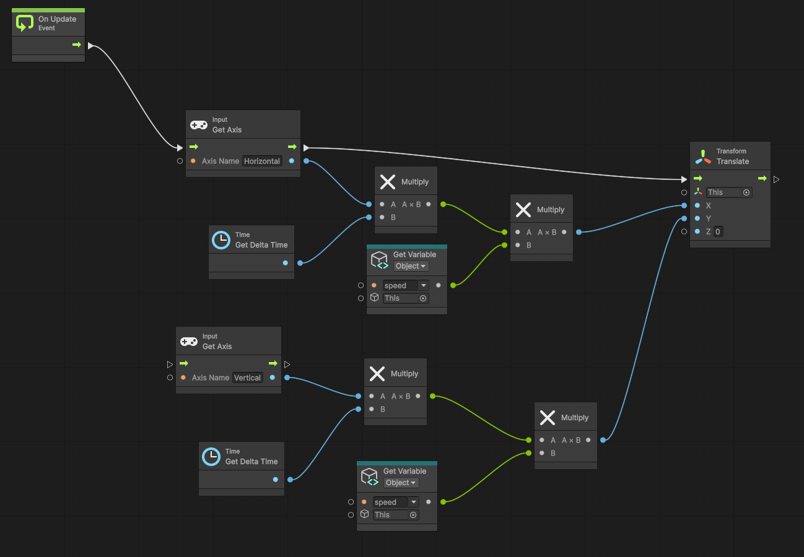

---

## Movement using Rigidbody
Was this feature implemented?
  > No

If yes, where did you use this feature in your prototype?
- Game Object(s):
  > _Write your response here_
- Script(s):
  > _Write your response here_
- Screenshot(s) of feature in game or scene view:
  > _Insert screenshot here_

---

## Gamepad Controls using an Input Asset
Was this feature implemented?
  > No

If yes, where did you use this feature in your prototype?
- Game Object(s):
  > _Write your response here_
- Script(s):
  > _Write your response here_
- Screenshot(s) of feature:
  > _Insert screenshot here_

---

## Trigger Colliders
Was this feature implemented?
  > Yes

If yes, where did you use this feature in your prototype?
- Game Object(s):
  > Player, Enemy, Spider, healthItem
- Script(s):
  > Player, Enemy, SpiderSpell, Health
- Screenshot(s) of feature in game or scene view:
  > 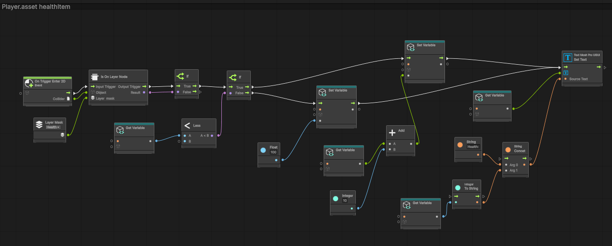 
  > 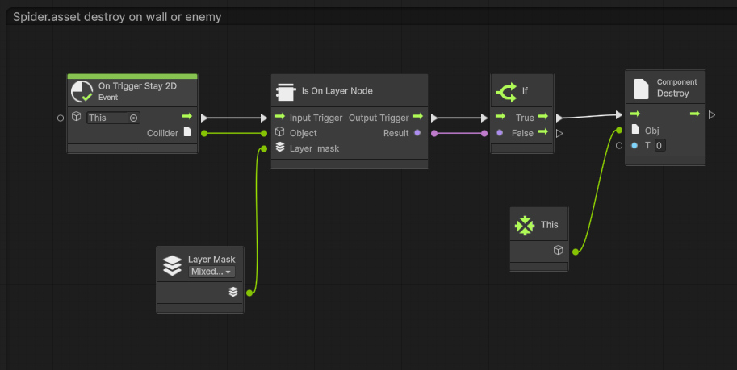
  > 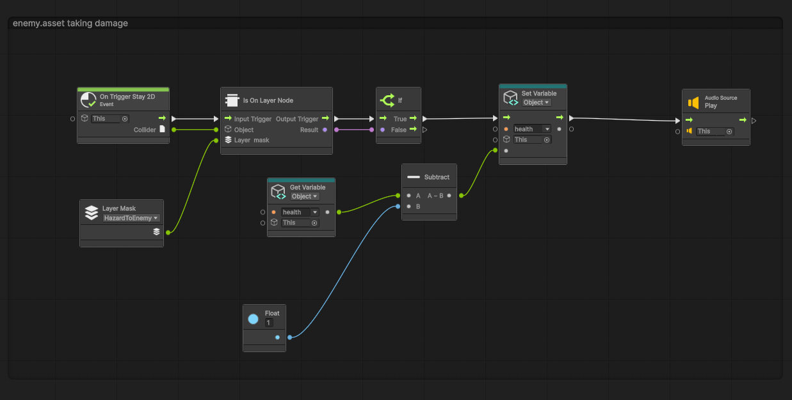 
  > 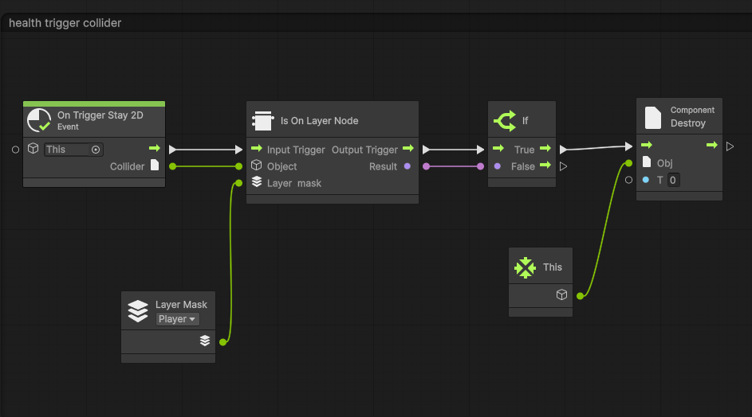 
  > 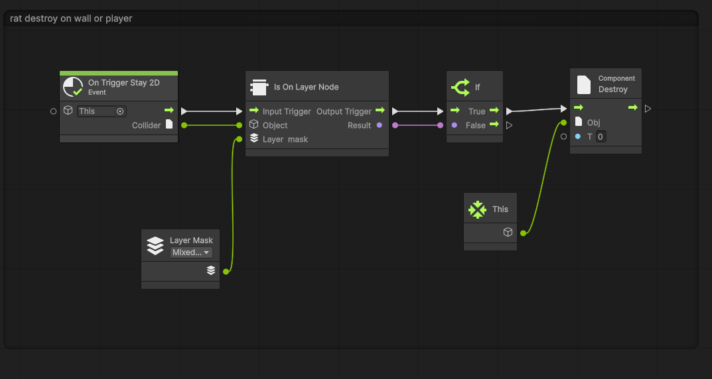 


---

## Physics colliders
Was this feature implemented?
  > No

If yes, where did you use this feature in your prototype?
- Game Object(s):
  > _Write your response here_
- Script(s):
  > _Write your response here_
- Screenshot(s) of feature in game or scene view:
  > _Insert screenshot here_

---

## Collision events

Was this feature implemented?
  > Yes

If yes, where did you use this feature in your prototype?
- Game Object(s):
  > Player colliding against walls and objects
- Script(s):
  > _Write your response here_
- Screenshot(s) of feature in game or scene view:
  > 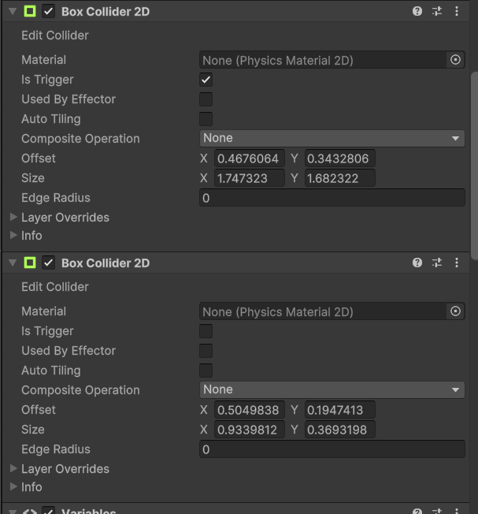 

---

## Prefabs
Was this feature implemented?
  > Yes

If yes, where did you use this feature in your prototype?
- Game Object(s):
  > Enemy, gameover (ugui text), healthItem, HealthText (ugui text), Player, Rat, SpiderSpell, Stave
- Script(s):
  > _Write your response here_
- Screenshot(s) of feature:
  > 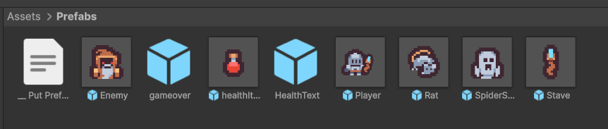 

---

## Prefab - Dynamic Instantiation
Was this feature implemented?
  > Yes

If yes, where did you use this feature in your prototype?
- Game Object(s):
  > Stave -> dynamically instantiating -> SpiderSpell
  > Enemy -> dynamically instantiating -> Rat
- Script(s):
  > Staff, Enemy
- Screenshot(s) of feature:
  > _Insert screenshot here_
  > 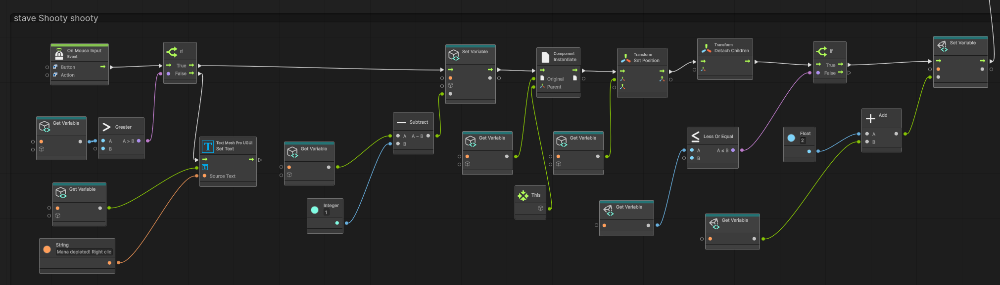 
  > 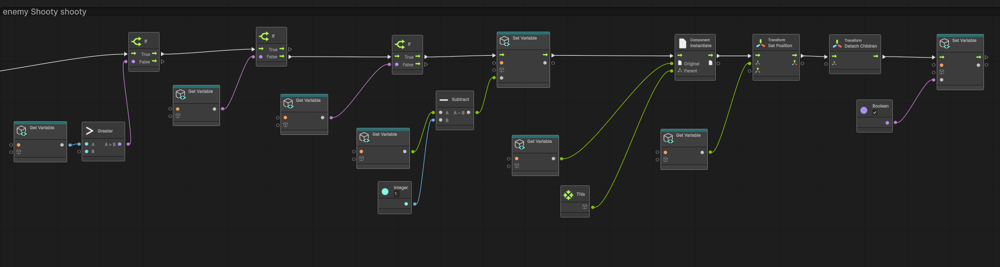 
---

## Object deactivation or destruction
Was this feature implemented?
  > Yes

If yes, where did you use this feature in your prototype?
- Game Object(s):
  > Player, Enemy, SpiderSpell, Rat, healthItem
- Script(s):
  > Player, Enemy, Spider, Rat, Health
- Screenshot(s) of feature in game or scene view:
  > 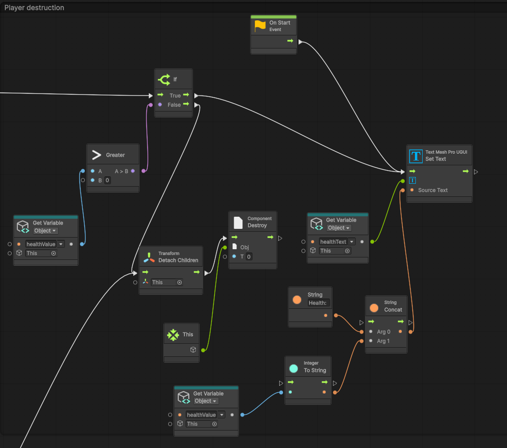 
  > 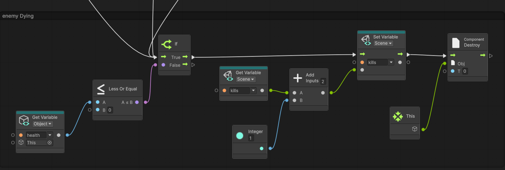 
  >  
  >  
  >  

---

## UI layout
Was this feature implemented?
  > Yes

If yes, where did you use this feature in your prototype?
- Game Object(s):
  > Canvas: HealthText, gameover, Ammo, scoreText, timeTexter
- Script(s):
  > _Write your response here_
- Screenshot(s) of feature in game view:
  >  

---

## UI updating
Was this feature implemented?
  > Yes

If yes, where did you use this feature in your prototype?
- Game Object(s):
  > Stave, Player
- Script(s):
  > Staff, Player
- Screenshot(s) of feature:
  > 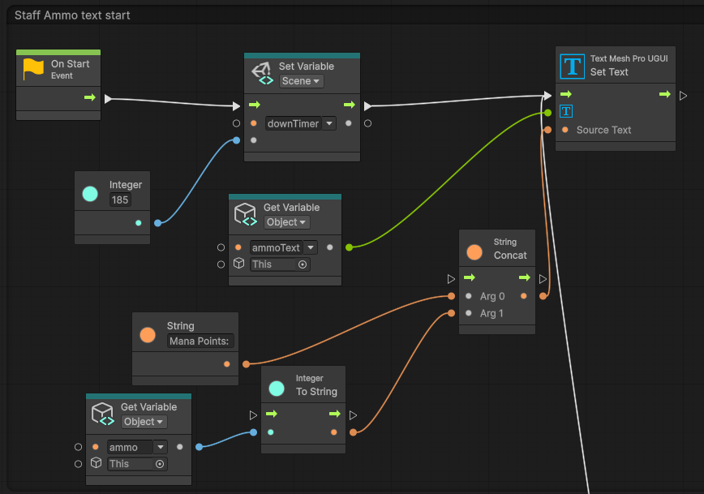 
  > 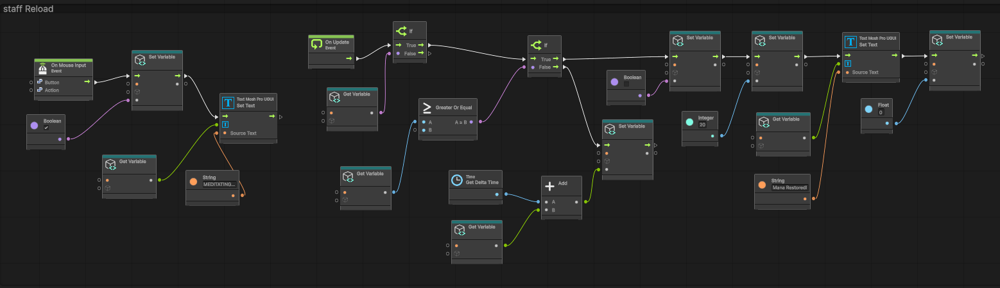
  > 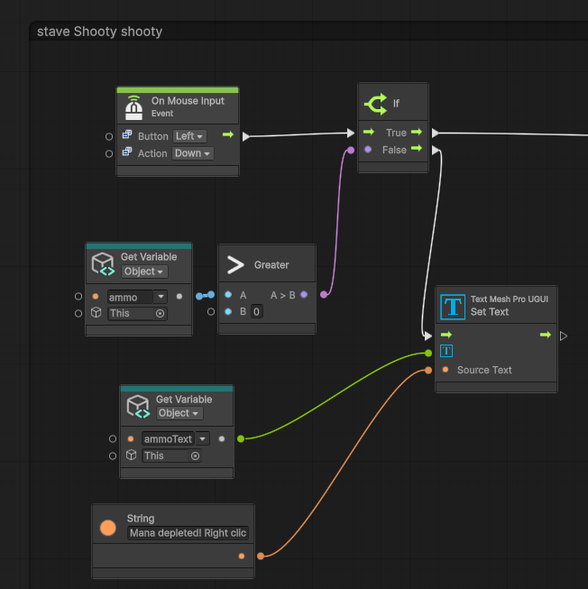 
  > 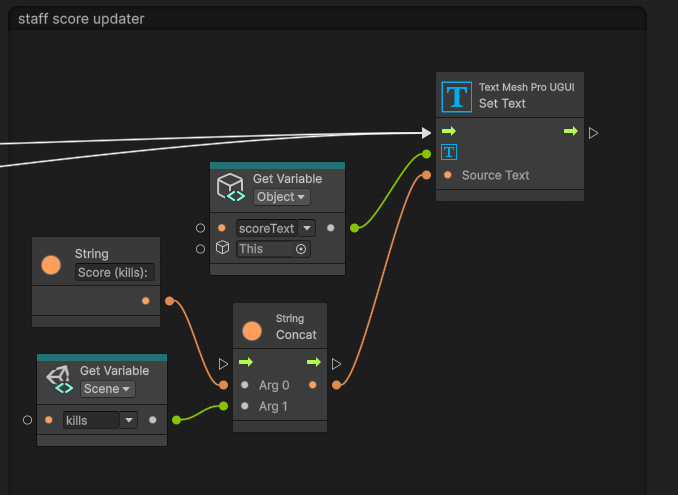 
  > 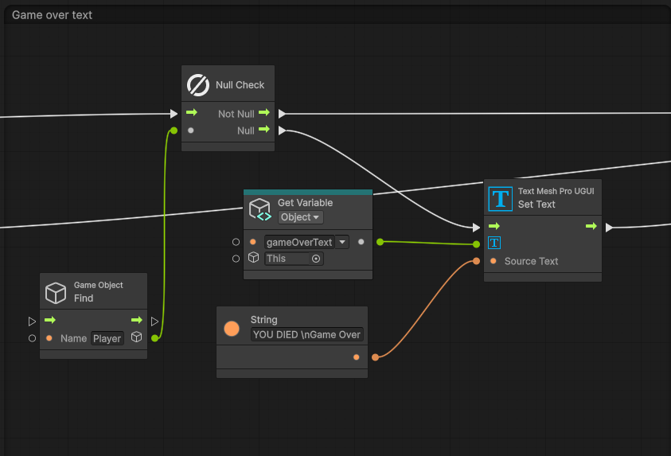 
  > 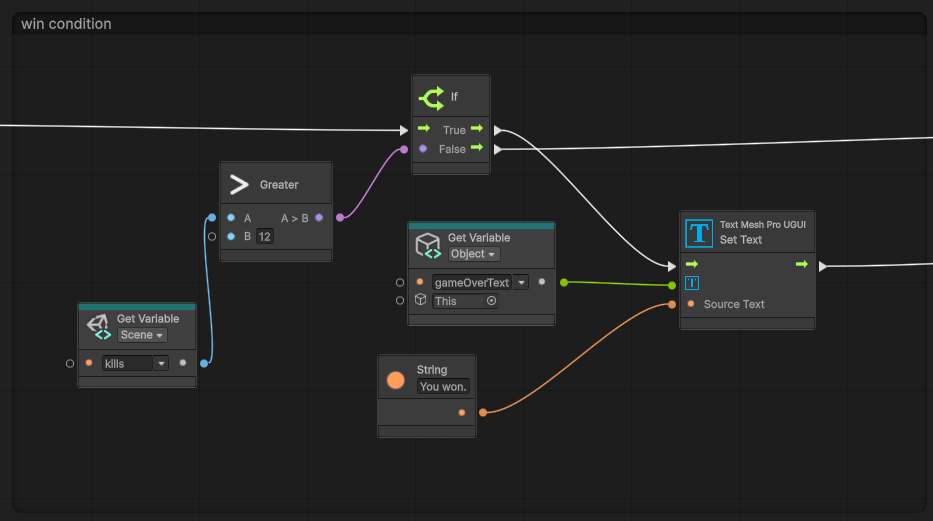 
  > 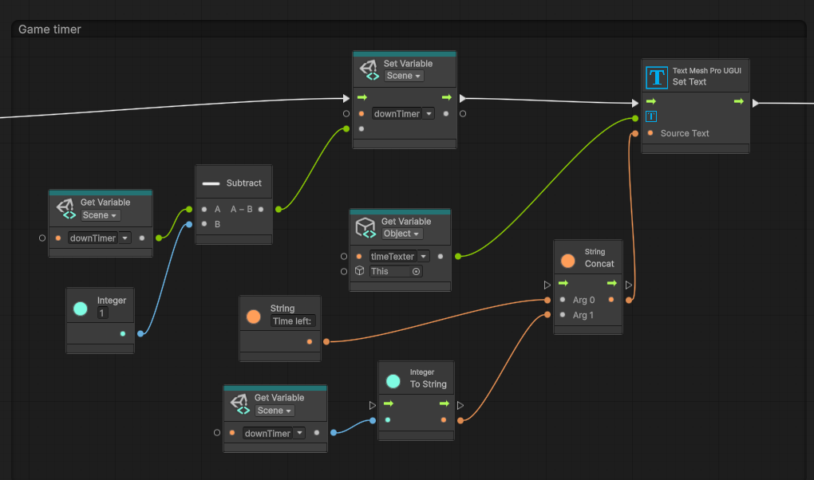 
  >  
  >  
  > 

## Camera - Basic
Was this feature implemented?
  > Yes

If yes, where did you use this feature in your prototype?
- Game Object(s):
  > Main Camera
- Script(s):
  > _Write your response here_
- Screenshot(s) of feature in scene view:
  > _Insert screenshot here_

---

### Camera - Cinemachine
Was this feature implemented?
  > No

If yes, where did you use this feature in your prototype?
- Game Object(s):
  > _Write your response here_
- Script(s):
  > _Write your response here_
- Screenshot(s) of feature in scene view:
  > _Insert screenshot here_

---

### Audio - Looping
Was this feature implemented?
  > Yes

If yes, where did you use this feature in your prototype?
- Game Object(s):
  > Main Camera -> audio source -> hitman.mp3
- Script(s):
  > _Write your response here_
- Screenshot(s) of feature in scene view:
  > 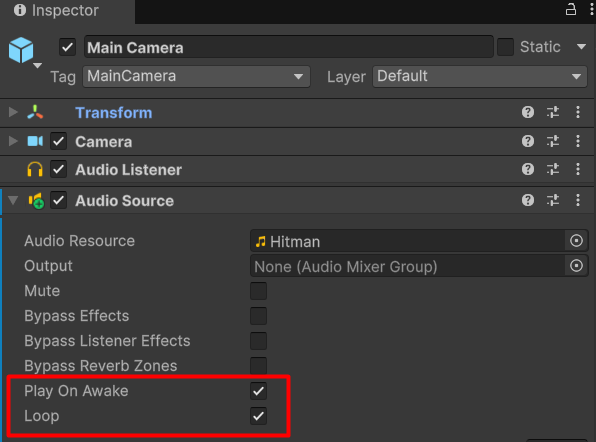 

---

### Audio - Events
Was this feature implemented?
  > Yes

If yes, where did you use this feature in your prototype?
- Game Object(s):
  > Player, Enemy
- Script(s):
  > Player, Enemy
- Screenshot(s) of feature in scene view:
  >  
  > 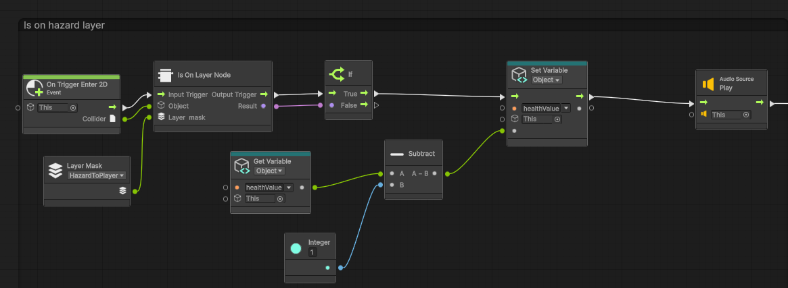
  
---

### WebGL Build
Was this feature implemented?
  > Yes 

If yes, make sure you include a link to the build at the top of this document.

- Screenshot(s) of game build running in external web browser:
  > 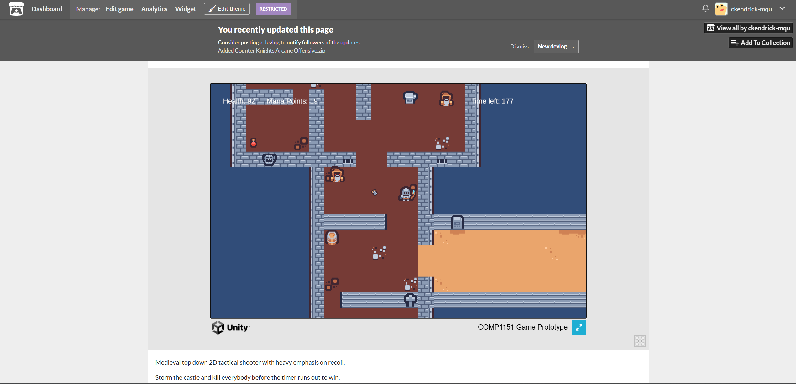 

---

# Third Party Assets

Cite any third part assets you used in your project here, including:
* The name of the asset
* The type of asset (tilemap, sprite, audio file)
* The developer
* A URL for the associate website
* The license under which it is distributed.

Collections of assets can be cited as a single line if they are distributed as a package.

An example has been provided. Delete this line if you didn't use this asset.

| Asset Name | Type | Developer | URL | License |
| ---------- | ---- | --------- | --- | ------- |
| Hitman | Audio file | Kevin MacLeod | https://incompetech.com/music/royalty-free/index.html?isrc=USUAN1300013&Search=Search | Creative Commons: By Attribution 3.0 License |
| Impact Sounds | Audio Files Tilemap & Sprites | Kenney | https://kenney.nl/assets/impact-sounds | Creative Commons CC0 |
| Tiny Dungeon | Tilemap & Sprites | Kenney | https://kenney.nl/assets/tiny-dungeon | Creative Commons CC0 |

--- 
# How to Insert Images in Markdown
**Instructions:**  
This document should include images. To insert an image into your documentation, place it in the "Images" subfolder, then place the below text where you want the image to appear:

```

```

Example:

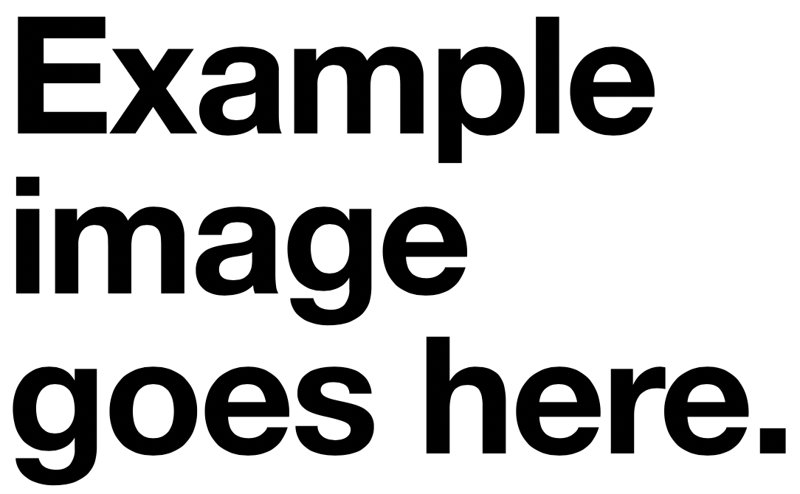
